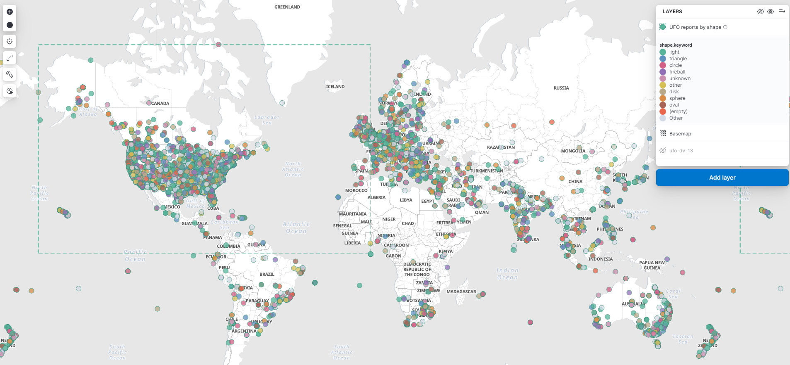
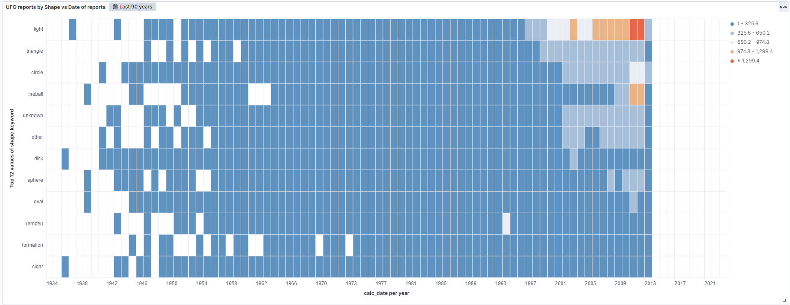
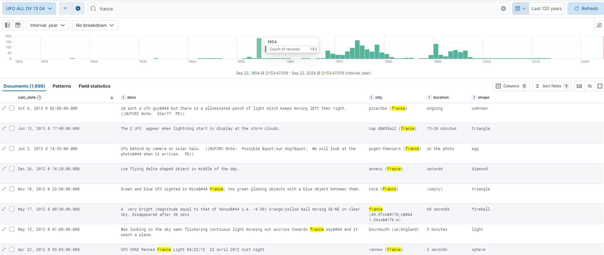

# ufo-data-elk
Use elasticsearch stack to store, enrich &amp; visualise UFO data

## Goals

Centralise different source of UFO / UAP in the elastic stack to be able to enrich and visualise these data!

See here a big map with color per UFO shape

## Prerequesites :
### Install elasticsearch stack elk : 

 eg using https://github.com/deviantony/docker-elk

 you may clone and execute this repo to get elk installed

### venv

    python -m venv ./venv
    source ./venv/bin/activate
    pip install stop-words
    pip install geopy
    pip install elasticsearch

### bert NER for elk

    pip install eland
    pip install 'eland[pytorch]'

https://medium.com/@psajan106/elasticsearch-8-named-entity-recognition-ner-using-inference-ingest-pipeline-8e7bd566c5e8

### get data from differents repo

#### Old nuforc data ? also available on kaggle. 
	mkdir data
	cd data
	wget https://raw.githubusercontent.com/planetsig/ufo-reports/refs/heads/master/csv-data/ufo-complete-geocoded-time-standardized.csv
	
#### richgel999 repo
    git clone https://github.com/richgel999/ufo_data

## Usage

### Load ufo-complete-geocoded-time-standardized.csv

	nohup python ./elk_loader_ufo-csv.py ./data/ufo-complete-geocoded-time-standardized.csv  > load-csv-01.log &

## Visualisation

### Link shape / period : raise og lights ?

### UFO in france peak in 1954

