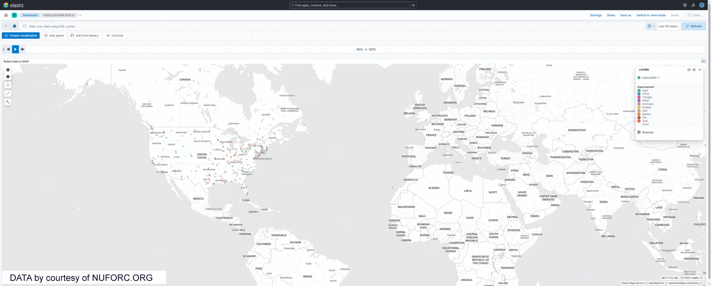
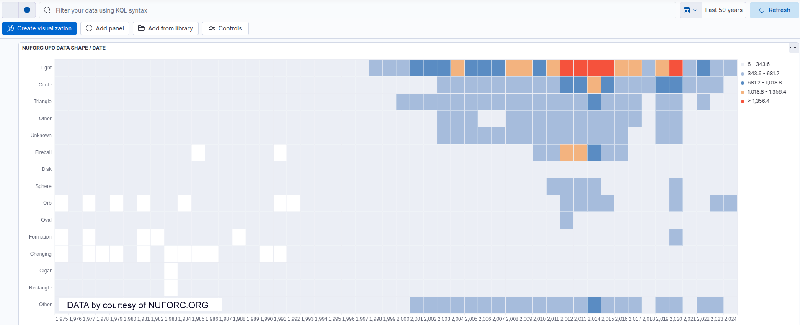
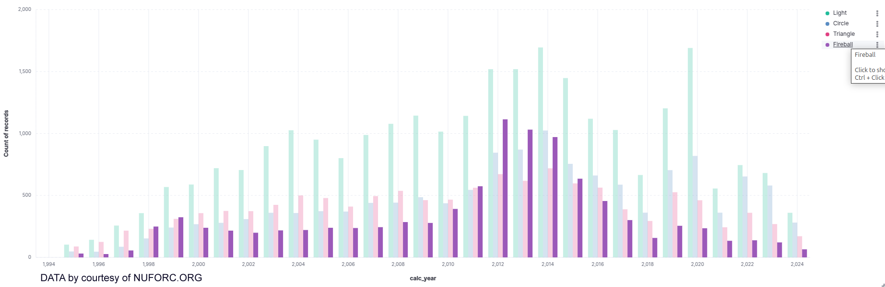
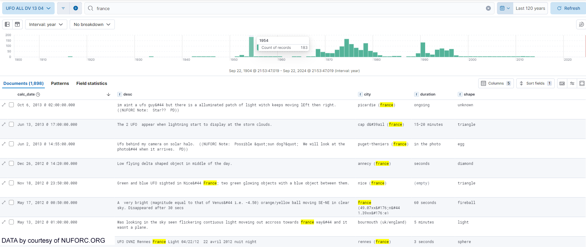
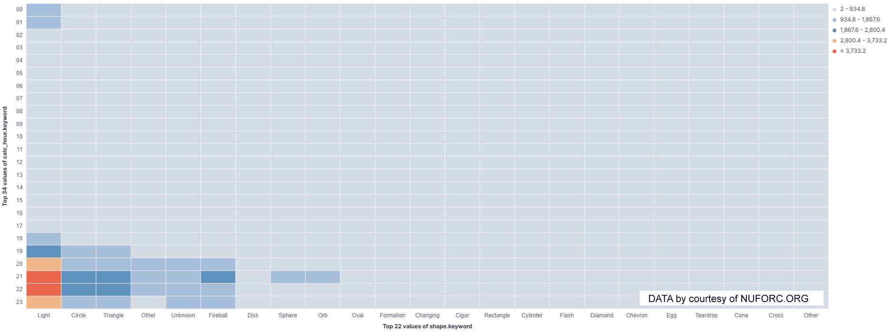
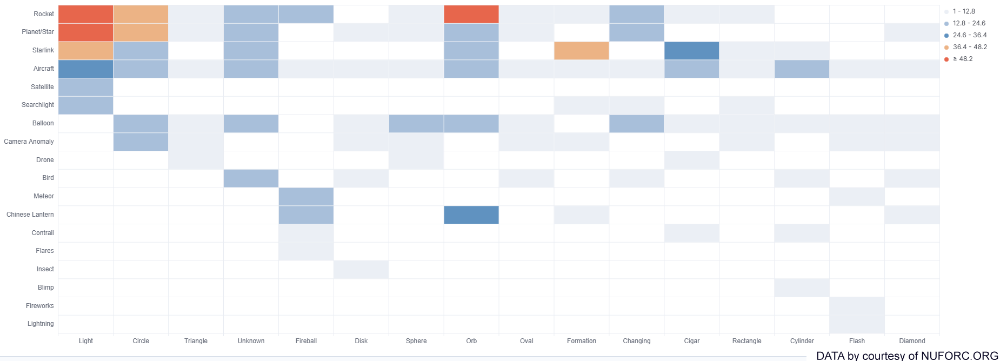

am# Playing with Elastic & Kibana with UAP (UFO) data
Use elasticsearch stack to store, visualise and enrich UAP (aka UFO) data


## Goals
Centralise different source of UFO / UAP in ELK to be able to enrich and visualise these data!
See here a big map with color per UFO shape
See other interesting visualisation at the end of the page



## Data
> [IMPORTANT]
> Data in screenshots are more accurate then the freely available ones linked below. 
> They are used for ilustrations with courtesy of NUFORC (see : https://nuforc.org/terms/ )
> NONE of these data are shared into this repository - only visualisations

## Prerequesites :
### Install elasticsearch stack elk : 

To get a working ELK stack, we can use docker ex in this repo : https://github.com/deviantony/docker-elk
You may clone and execute this repo to get elk installed

```sh
docker compose up setup
docker compose up
```

For this example we can keep default password;
user: elastic
password: changeme

http://<ip>:5601/

### venv
```sh
python -m venv ./venv
source ./venv/bin/activate
pip install stop-words
pip install geopy
pip install elasticsearch
pip install spacy
pip install Openpyxl

python -m spacy download en_core_web_sm
```


Optionnal  bert NER for elk
```sh
pip install eland
pip install 'eland[pytorch]'
```

Example that could be used : 
https://medium.com/@psajan106/elasticsearch-8-named-entity-recognition-ner-using-inference-ingest-pipeline-8e7bd566c5e8


### get data from differents repo

#### Old nuforc data ? also available on kaggle here : https://www.kaggle.com/datasets/NUFORC/ufo-sightings

```sh
mkdir data
cd data
wget https://raw.githubusercontent.com/planetsig/ufo-reports/refs/heads/master/csv-data/ufo-complete-geocoded-time-standardized.csv
```	


## Usage

### Load ufo-complete-geocoded-time-standardized.csv

```sh
nohup python ./elk_loader_ufo-csv.py ./data/ufo-complete-geocoded-time-standardized.csv  > load-csv-01.log &
```

## Calculated field / curation

- calc_date: Important: datetime objet that will be used in Kibana timestamp. As the source file can have different date, we need to care (=to curate ) 
- calc_year: Year string
- calc_dayofweek : Clear...
- calc_moment: Morning, afternoon, evening, night
- calc_geo: Important, use the created index to make maps, using  "calc_geo": { "type": "geo_point" }
- calc_src : Data source name
- calc_kw : All non stopwords words

## Interesting Visualisation

### Link shape / period : raise of lights ?
By comparing the shape and the time of observation, it appears that since 2012, there is a peak of obeservation in the lights, 



### Raise of the fireballs
This can also be observed in this bar diagram, where we see tht the raise of fireball observation in 2012/13 : 



### UFO in france peak in 1954
We can observe, even in this US centric data the famous peak of observation in France in 1954



### Link moment of day / shape : Light in the night
Then looking at this heat map, we can see the hour in the day and the number of observation by shape. It show that UFO are Lights in the Sky :) 



### Observation explanation vs shape
Another heatmap to see the explaination versus the shapes. 



